# NYX SYS

A desktop-first, offline-capable business management platform, built and deployed for a live salon client (Northern Bloom, Kathua). Built end to end — architecture, UI, backend, and the sync layer.

> Source is private — client data and business logic live in this codebase. This repo is a walkthrough of what it does. Screenshots with real customer/staff data have been redacted; the underlying UI is untouched.

**Stack:** Electron · React · TypeScript · SQLite · Express · Monorepo (desktop, booking, server, shared package)

---

## Architecture

- **Monorepo** — separate apps for desktop, booking site, and server, sharing a common package so business logic isn't duplicated across the desktop app and the public booking site.
- **Offline-first** — the desktop app works without a live connection and syncs when back online ("Synced · just now" in the header reflects this).
- **Role-based access** — distinct permission levels for Owner, Staff, Counter, and Developer, each seeing a different view of the same system.

---

## Login

PIN-based login, branded per salon.

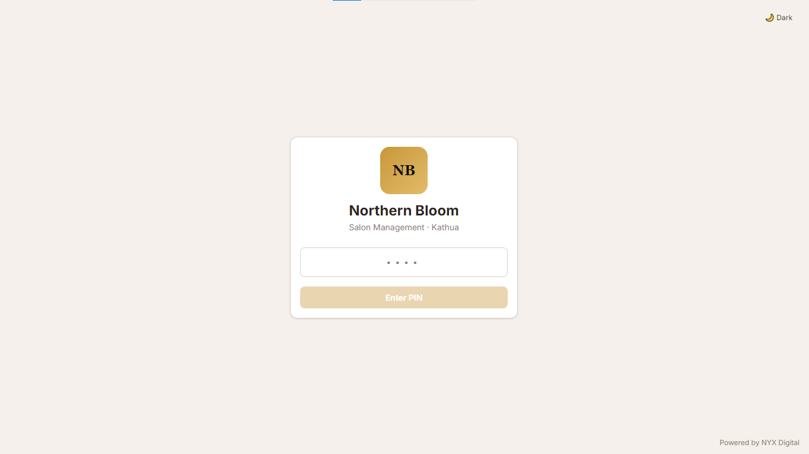

## Dashboard

Revenue trends, peak hours, staff performance, and service popularity at a glance.

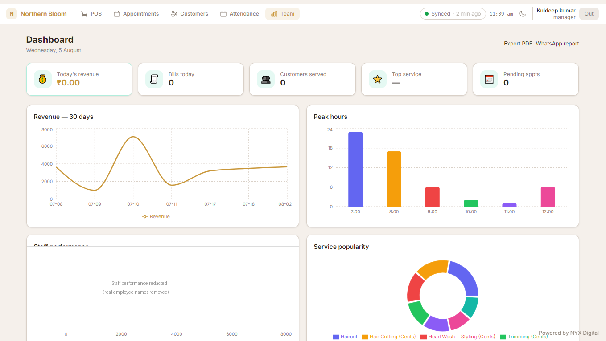

## POS Counter

A guided 3-step billing flow: find customer → select services → payment.

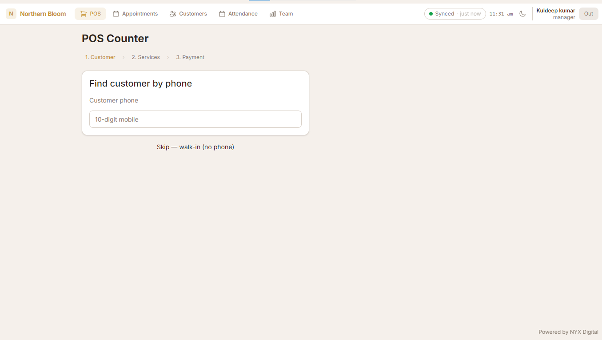

## Appointments

Calendar-based scheduling, filterable by status, with a live feed of bookings coming in from the public booking website.

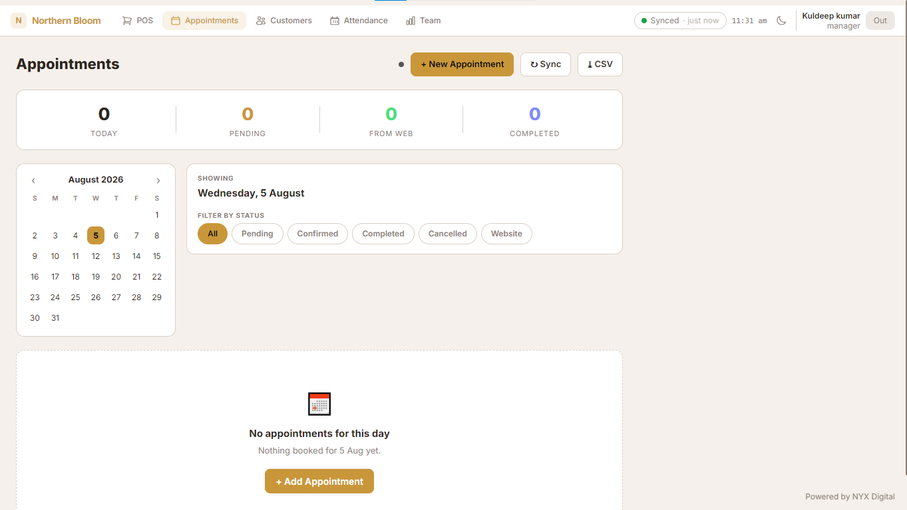

## Customers

Customer database with visit history and quick search by name or phone.

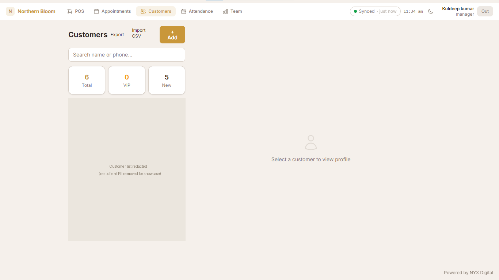

## Attendance

Daily staff attendance tracking — present / half-day / absent, exportable to CSV.

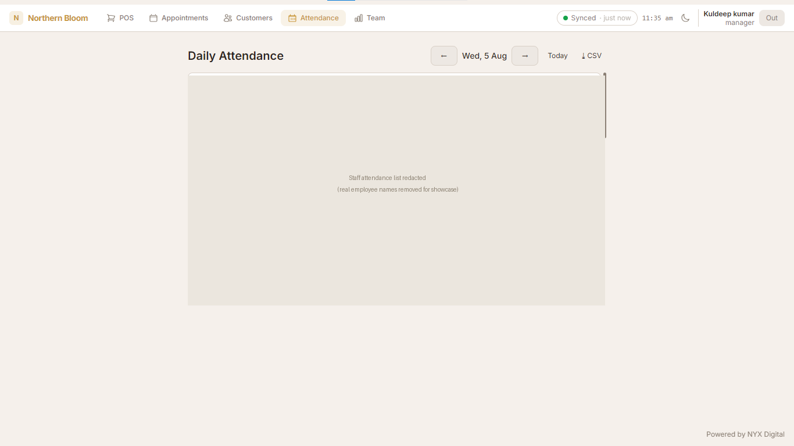

---

## Booking Website

A separate, public-facing app (Next.js) that lets customers book appointments directly — syncs with the desktop app in real time through the shared package. Live and in daily use.

**Live: [northernbloom.in](https://northernbloom.in)** — 4.5★ on Google, 780+ reviews.

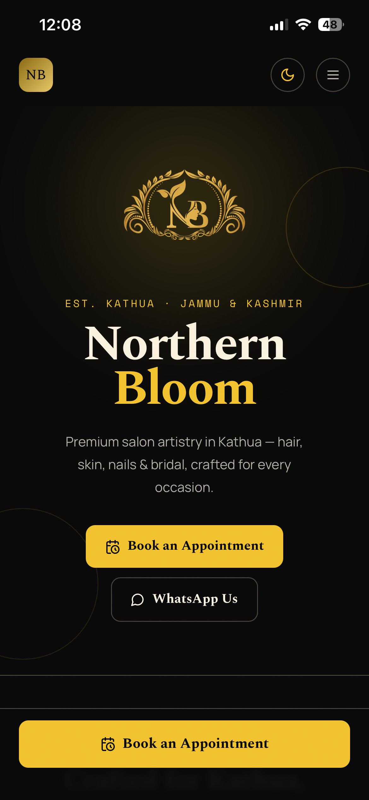
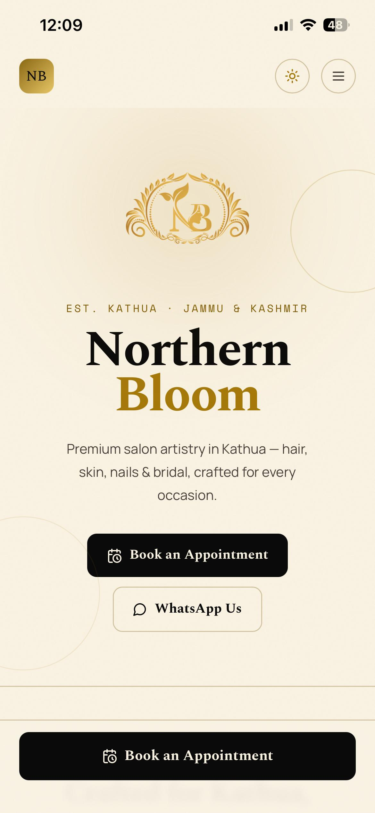

Service packages, priced as one — no surprises at checkout.

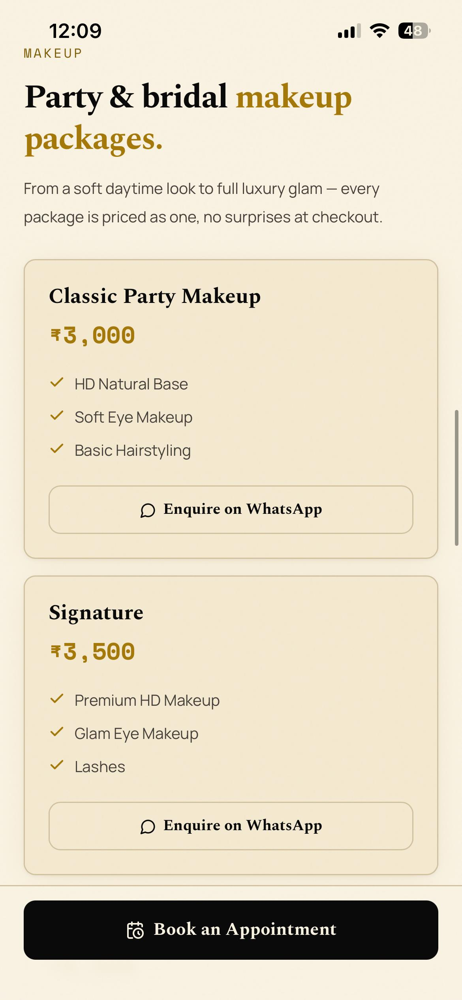

Google reviews pulled straight into the page.

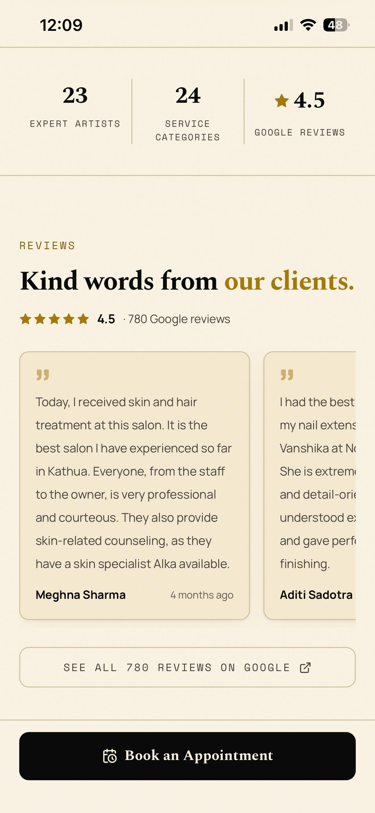

A guided 6-step booking flow: category → service → staff → time → details → confirm.

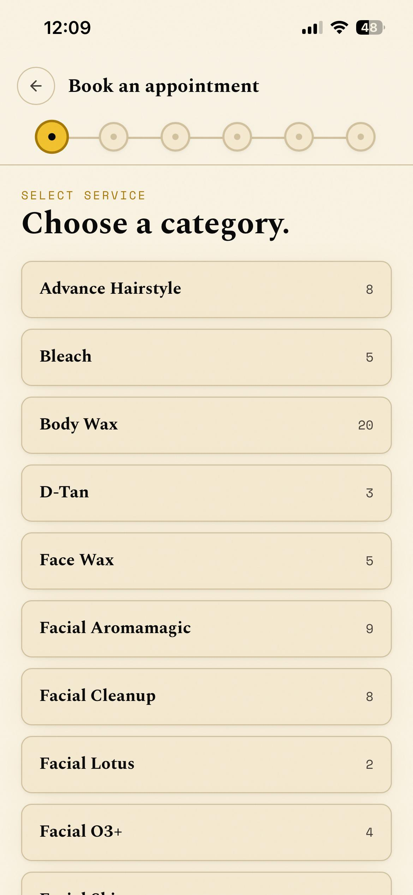
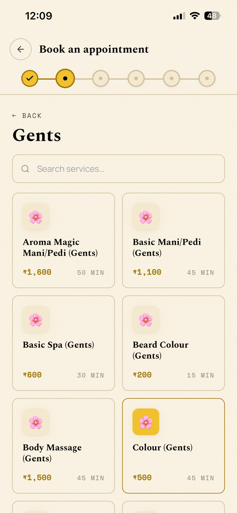
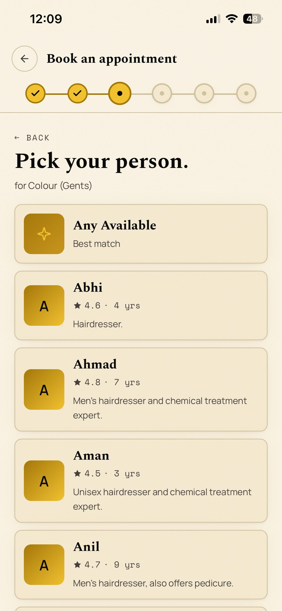
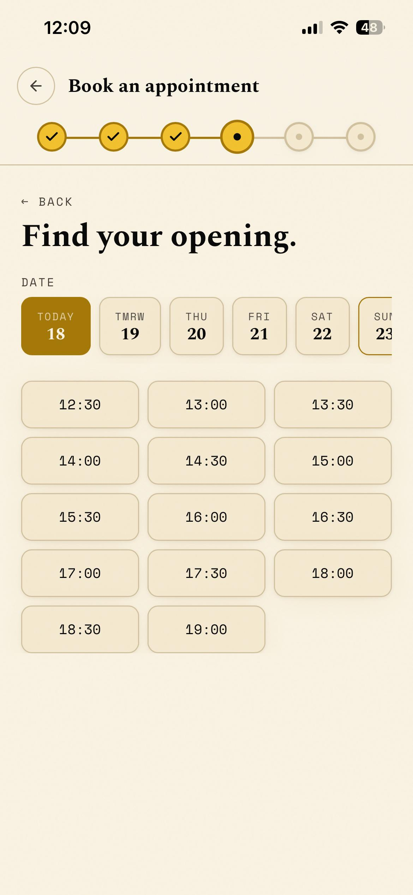
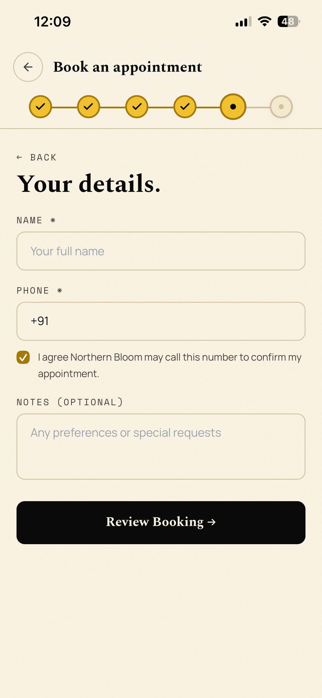
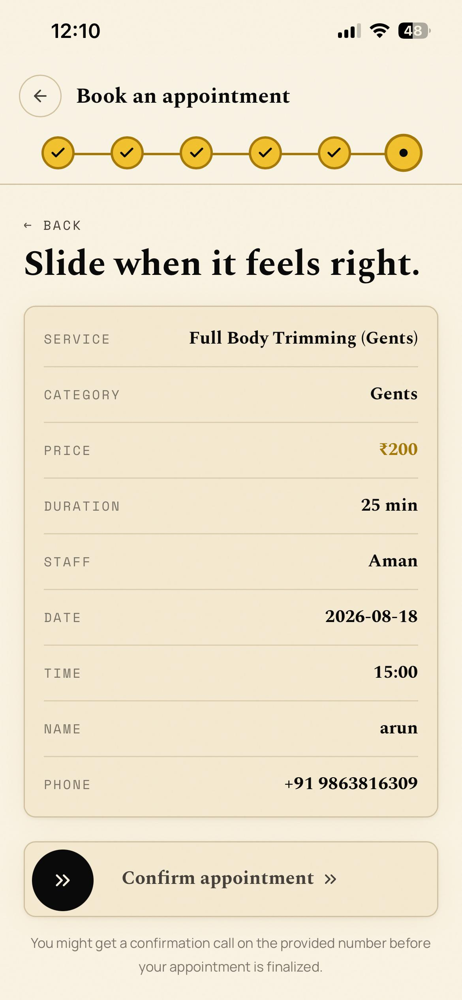
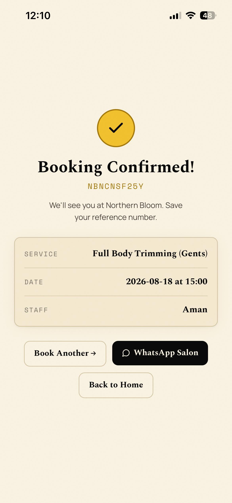

## Also in the system (not pictured here)

Counter billing with QR payments, staff commission tracking, inventory management, and a developer-only admin panel for system config and backups.

---

## Status

Actively running for a real client. Still evolving — not a finished, feature-frozen product, but genuinely in daily use.
